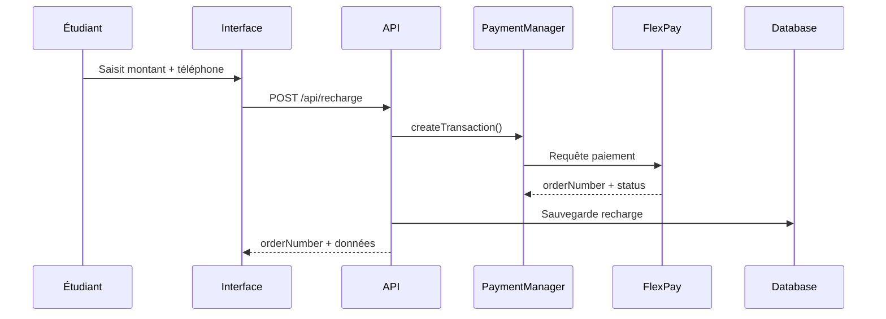
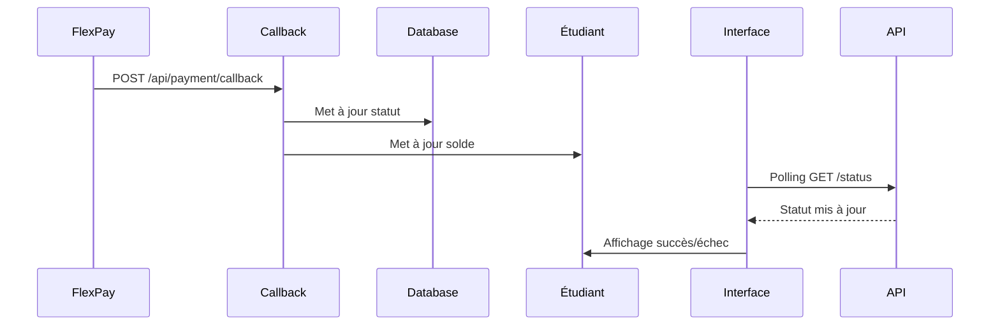

# 💳 Système de Paiement et Recharge

## 🎯 Vue d'ensemble

Le système de paiement permet aux étudiants de recharger leur compte via **FlexPay** (Mobile Money) avec une intégration complète incluant :

- **Création de transactions** avec validation
- **Suivi en temps réel** du statut des paiements
- **Callbacks automatiques** pour la confirmation
- **Mise à jour du solde** étudiant
- **Interface utilisateur** intuitive avec états visuels

## 🏗️ Architecture

### **1. PaymentManager** (`lib/utils/PaymentManager.ts`)
Utilitaire principal basé sur votre `MoneyManager.js` original :

```typescript
// Créer une transaction
const result = await paymentManager.createTransaction({
    amount: 50,
    currency: 'USD',
    reference: 'RCH123456',
    phone: '+243123456789',
    description: 'Recharge de compte étudiant'
});

// Vérifier le statut
const status = await paymentManager.checkTransaction({
    orderNumber: 'RCH123456'
});
```

### **2. Modèle Recharge** (`models/Recharge.ts`)
Structure de données pour persister les recharges :

```typescript
interface IRecharge {
    orderNumber: string;        // Généré automatiquement
    currency: string;          // USD, CDF, EUR
    phone: string;            // Numéro mobile money
    amount: number;           // Montant à recharger
    status: 'pending' | 'completed' | 'failed' | 'cancelled';
    etudiantId: ObjectId;     // Référence à l'étudiant
    transactionId?: string;   // ID de transaction FlexPay
}
```

### **3. API Routes**

#### **POST /api/recharge** - Créer une recharge
```json
{
    "etudiantId": "64f...",
    "amount": 50,
    "currency": "USD",
    "phone": "+243123456789",
    "description": "Frais de scolarité"
}
```

#### **GET /api/recharge/[orderNumber]/status** - Vérifier le statut
```json
{
    "success": true,
    "data": {
        "orderNumber": "RCH123456",
        "status": "completed",
        "newBalance": 150
    }
}
```

#### **POST /api/payment/callback** - Callback FlexPay
Endpoint automatique pour recevoir les notifications de paiement.

## 🔄 Flux de Paiement

### **1. Initiation**


### **2. Confirmation**


## 🎨 Interface Utilisateur

### **États du Composant RechargeSetting**

1. **Formulaire** (`form`)
   - Saisie montant, devise, téléphone
   - Validation en temps réel
   - Affichage du solde actuel

2. **Traitement** (`processing`)
   - Spinner de chargement
   - Message "Confirmez sur votre téléphone"
   - Polling automatique du statut

3. **Succès** (`success`)
   - Icône de validation
   - Nouveau solde affiché
   - Bouton "Nouvelle recharge"

4. **Erreur** (`error`)
   - Icône d'erreur
   - Message d'erreur détaillé
   - Bouton "Réessayer"

## 🔧 Configuration

### **Variables d'environnement**
```env
# FlexPay Configuration
FLEX_HOST=https://backend.flexpay.cd/api/rest/v1/paymentService
FLEX_CHECK=https://backend.flexpay.cd/api/rest/v1/check/
FLEX_TOKEN=your-flexpay-token-here
FLEX_MERCHANT=your-merchant-id-here

# Application
NEXT_PUBLIC_BASE_URL=http://localhost:3000
```

### **Callback URL**
Le système configure automatiquement l'URL de callback :
```
{NEXT_PUBLIC_BASE_URL}/api/payment/callback
```

## 📱 Hook useRecharge

Hook React pour gérer les recharges côté client :

```typescript
const {
    createRecharge,
    checkRechargeStatus,
    pollRechargeStatus,
    validateRechargeData,
    loading,
    error
} = useRecharge();

// Créer une recharge
const result = await createRecharge({
    etudiantId: '64f...',
    amount: 50,
    currency: 'USD',
    phone: '+243123456789'
});

// Polling automatique
pollRechargeStatus(orderNumber, (status) => {
    if (status.status === 'completed') {
        // Paiement réussi
    }
});
```

## 🛡️ Sécurité et Validation

### **Côté Client**
- Validation des montants (min/max par devise)
- Validation des numéros de téléphone
- Formatage automatique des numéros

### **Côté Serveur**
- Vérification de l'existence de l'étudiant
- Validation des données avant envoi à FlexPay
- Gestion des erreurs et timeouts
- Protection contre les doublons

## 🔍 Monitoring et Debug

### **Logs Automatiques**
```typescript
console.log("🔄 Création de transaction:", { amount, currency, phone });
console.log("✅ Réponse FlexPay:", { success, orderNumber });
console.log("📞 Callback reçu:", callbackData);
```

### **Endpoints de Test**
- `GET /api/payment/callback` - Vérifier que le callback fonctionne
- `GET /api/recharge?etudiantId=...` - Historique des recharges

## 🚀 Utilisation

### **Pour l'Étudiant**
1. Accéder à "Recharger mon compte"
2. Saisir le montant et le numéro de téléphone
3. Cliquer sur "Procéder au paiement"
4. Confirmer sur le téléphone mobile
5. Attendre la confirmation automatique

### **Pour l'Admin**
- Consulter l'historique des recharges
- Vérifier les statuts manuellement
- Gérer les remboursements si nécessaire

## 🔄 Workflow Complet

1. **Étudiant** remplit le formulaire de recharge
2. **Système** crée l'enregistrement en base avec `status: 'pending'`
3. **PaymentManager** envoie la requête à FlexPay
4. **FlexPay** retourne un `orderNumber` et initie le paiement mobile
5. **Interface** démarre le polling pour vérifier le statut
6. **Étudiant** confirme le paiement sur son téléphone
7. **FlexPay** envoie un callback à `/api/payment/callback`
8. **Système** met à jour le statut et le solde étudiant
9. **Interface** affiche la confirmation de succès

Ce système offre une **expérience utilisateur fluide** avec un **suivi en temps réel** et une **intégration robuste** avec FlexPay ! 🎯
